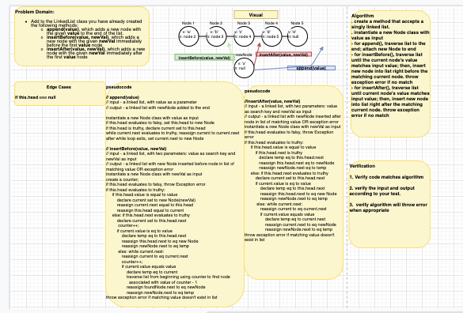

# linked-list
 

# Challenge
Write a method which adds a new node with the given value to the end of the list. 
write a method which add a new node with the given newValue immediately before the first value node
write a method which add a new node with the given newValue immediately after the first value node. 

# Approach & Efficiency

identify the start and end of the linked list 

# Solution
<!-- embedded whiteboard image -->

